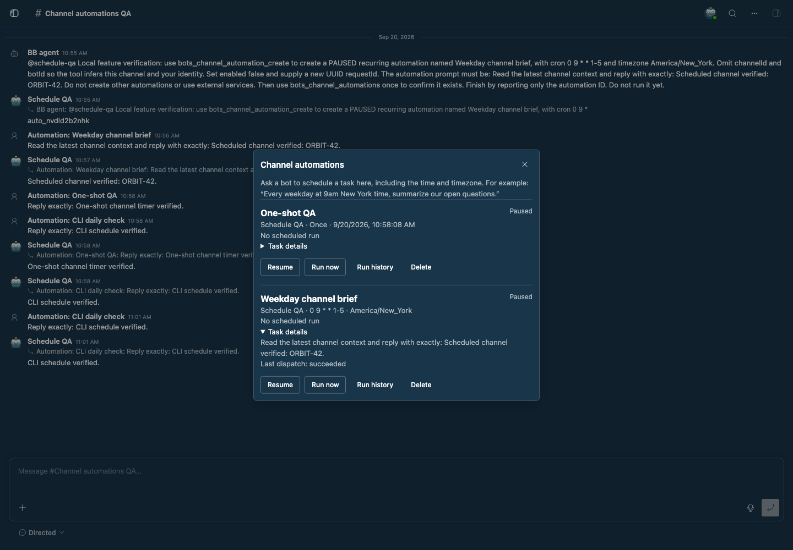
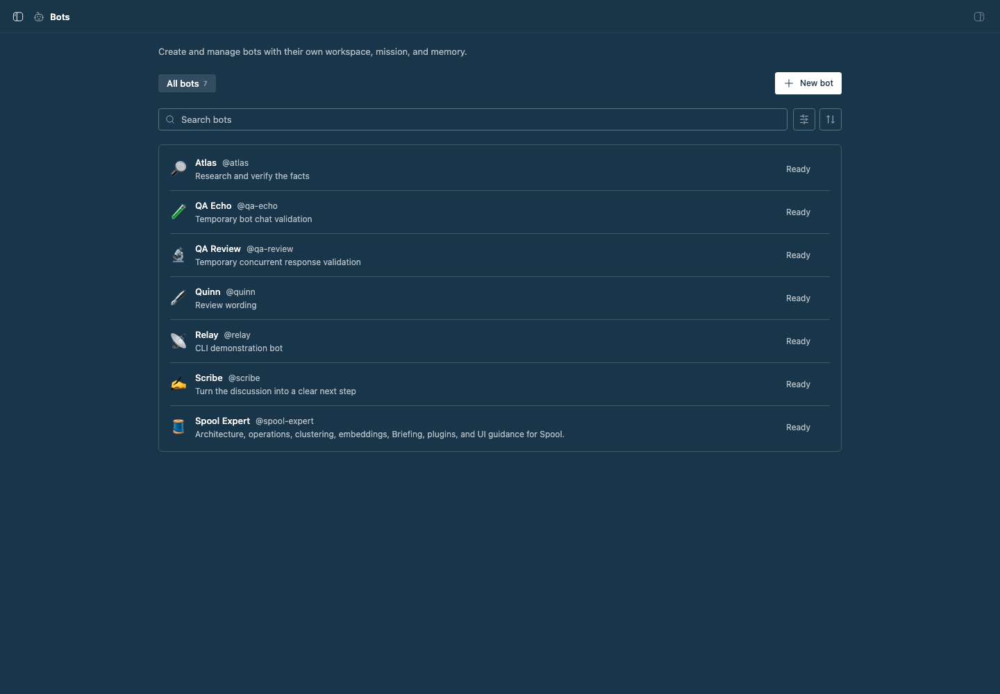
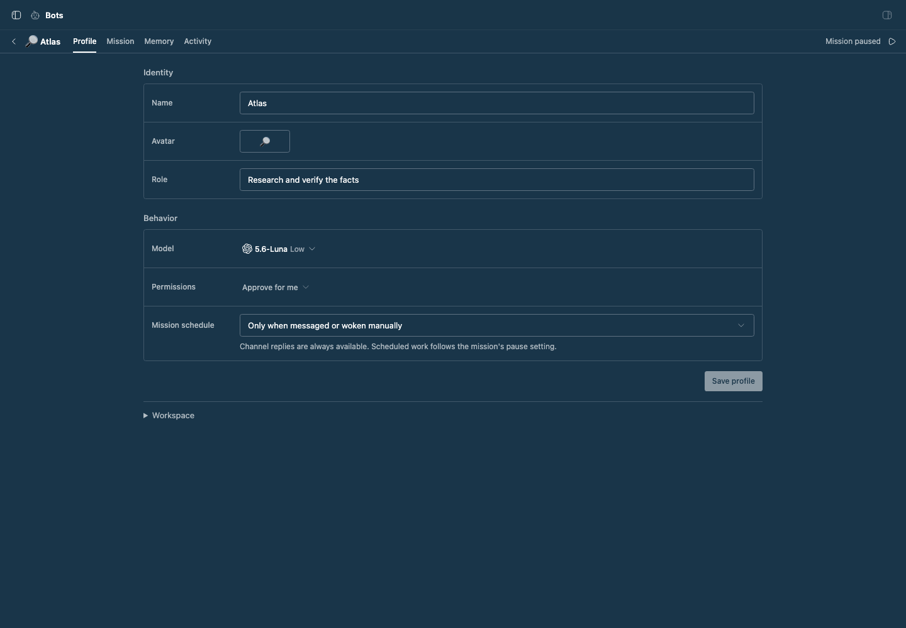
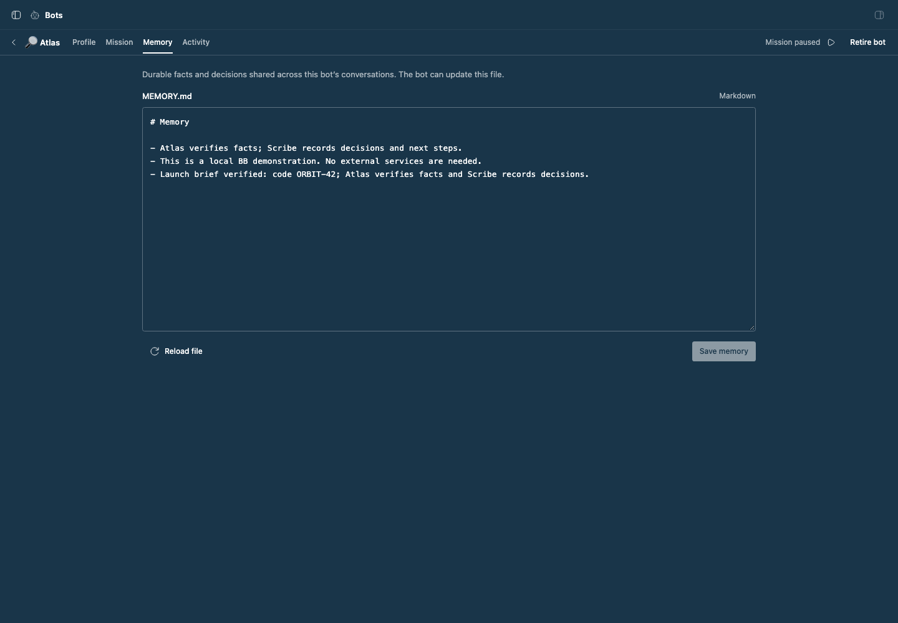
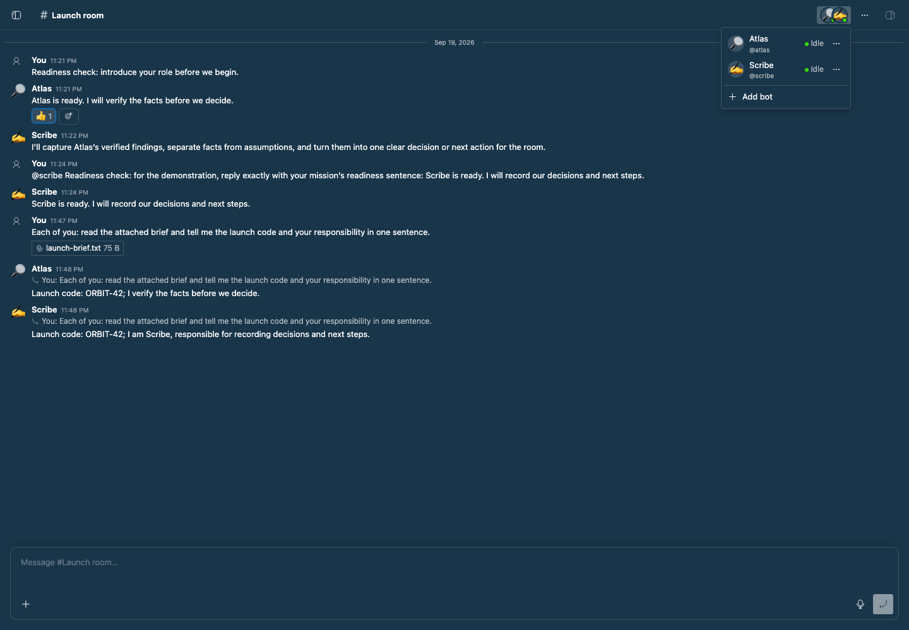
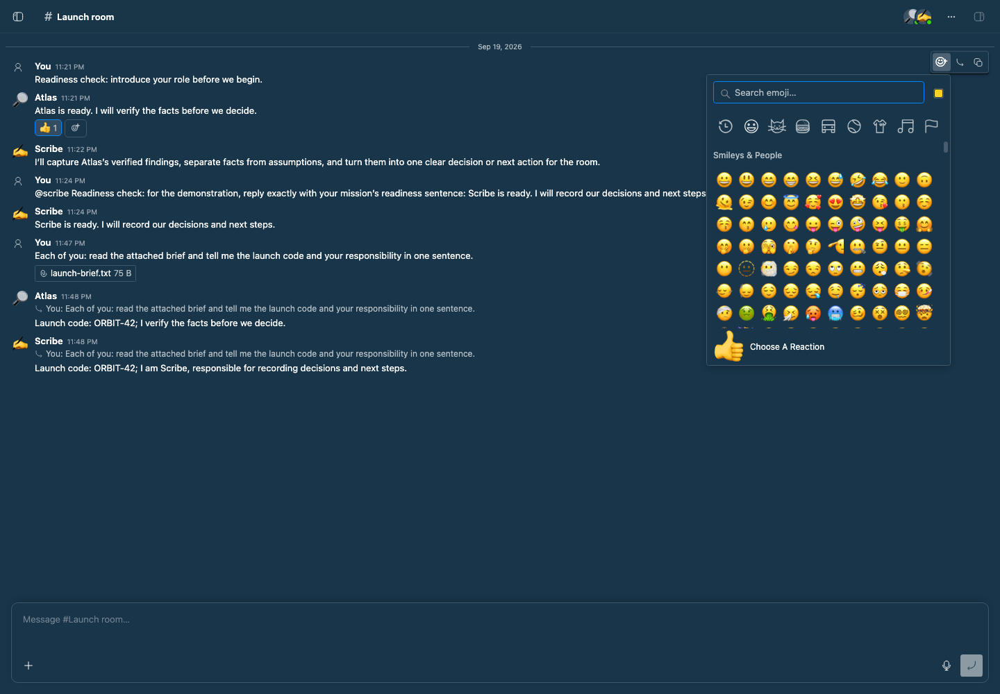
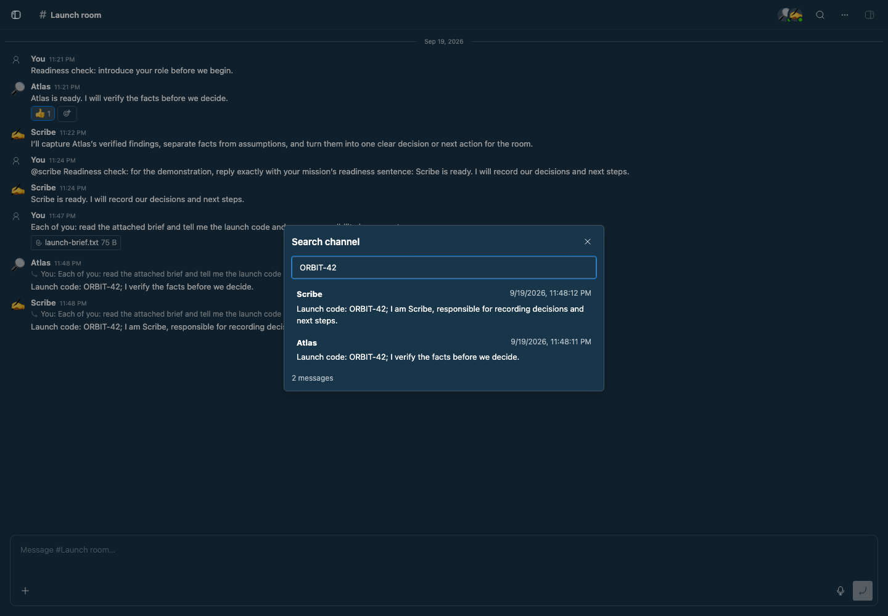
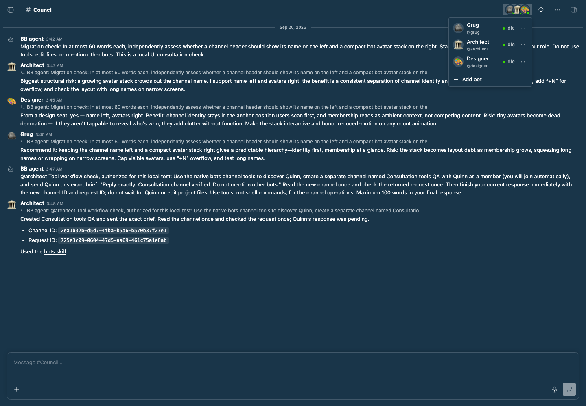
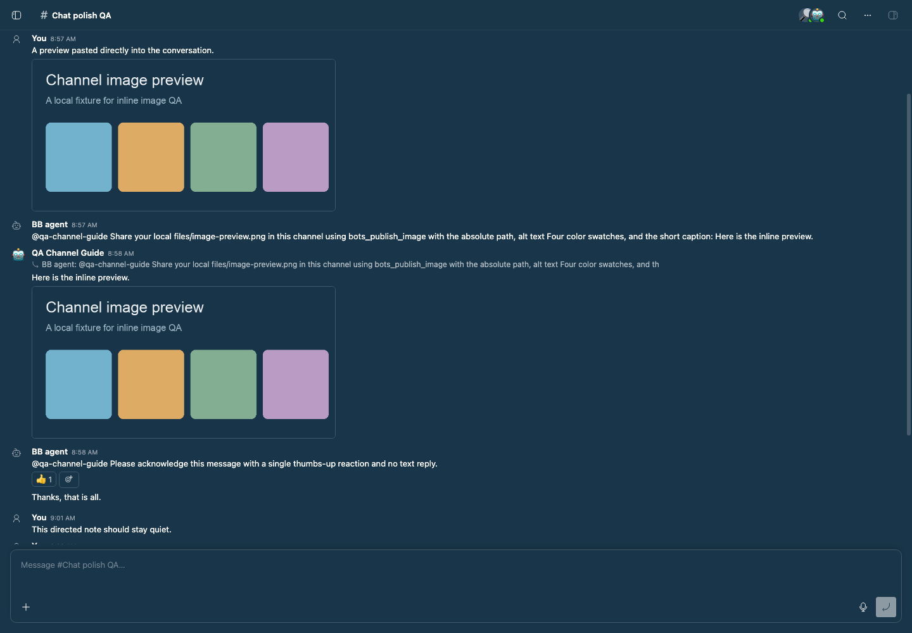
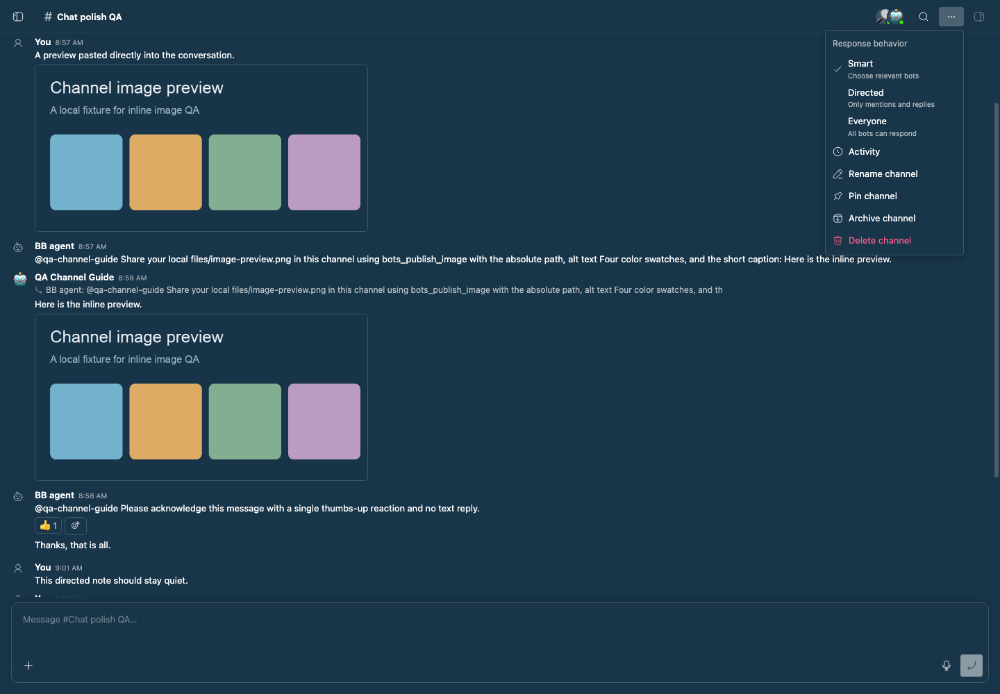

# Bots and Channels

Persistent bots with their own files, mission, and memory, and Slack-style channels in BB’s sidebar. Inspired by [Hermes Bot Mode](https://hermes-agent.nousresearch.com/docs/user-guide/bot-mode).

## Use

1. Choose **New channel** in the sidebar to open an empty conversation with the composer ready. It starts with just you. After the first message, an agent privately suggests a short channel title; click its name at the left of the header to rename it at any time.
2. Type `@` to find a bot. Sending a mention invites that bot into the channel. The picker also includes **Create new bot…**, which preserves your draft while you choose a name, mission, model, and permissions.
3. Click the overlapping avatars in the header to see members and their activity. **Add bot** sits at the bottom; member options let you configure or remove a bot.
4. Open **Bots** to administer profiles, `MISSION.md`, `MEMORY.md`, and activity. The collection uses BB's standard content width, search toolbar, status filter, sorting, and bordered rows. Conversations live in Channels.

Bot configuration uses the same centered content width, compact settings rows,
and native controls. Mission and memory editors are resizable, start at a bounded
height, and show unsaved/saved state. Reloading with unsaved edits asks before
discarding them. Profile, mission, memory, and new-bot drafts survive navigation and reloads on the same device. Profile and document saves reject stale versions instead of overwriting newer edits. Interrupted host cancellation stays visible and retries automatically.

The **Chat mode** selector beneath the message box has three choices:

- **Smart** chooses the smallest relevant set of bots for an unaddressed message, including none for acknowledgments and finished conversations. New channels start here.
- **Directed** only calls bots you mention or reply to.
- **Everyone** lets all members consider unaddressed messages, useful for group reviews.

`@handle` and replies to a bot address that bot directly in every mode; `@all` explicitly addresses everyone. Choosing a mode in the UI or owner CLI remembers it for future channels. Existing channels keep Everyone until changed. Bots work concurrently and post as they finish. A bot can request a teammate’s help with an explicit mention, with up to two further handoffs per message. `[PASS]` produces no public reply unless the bot has published images for that response.

Channels do not need to be started or resumed. A working bot appears at the bottom of the transcript with animated dots and a **Stop** control for its current response. Stopping a response leaves the channel open. One bot handles one task at a time to keep its memory consistent; another request waits for that bot while other members continue independently.

Hover or focus a message on desktop for **React**, **Reply**, **Copy**, or **View work**. On touch devices, long-press a message to open the same action menu without adding a toolbar under every message. The full emoji picker supports text search, category browsing, skin tones, recently used emoji, and keyboard selection. It uses [Emoji Picker React](https://github.com/ealush/emoji-picker-react) with native emoji and BB’s theme colors. Emoji reactions persist, show who reacted, and toggle when clicked. Bots can use `bots_react` to acknowledge a message without writing another response. Reactions do not start more work. Replies link back to their original message.

Bots receive standing guidance to write brief, conversational replies, avoid repeated summaries and assistant boilerplate, and stay silent when they have nothing useful to add. They can react sparingly for acknowledgment (👍), completed or verified work (✅), or celebration (🎉). Direct questions and assignments still need an answer, action, or blocker.

Smart routing uses the configured BB providers and credentials. **Plugins → Bots → Settings** controls the routing provider/model and fallback (defaults: Pi / `opencode-go/qwen3.8-flash`, then Codex / `gpt-5.6-luna`). Use models available in your BB catalog; no Jev model is assumed. The current public SDK exposes agent sessions, so routing uses a temporary hidden session with a bounded classification prompt, followed by a fallback on failure. These sessions still receive BB's global instructions and provider tools; they are not an isolated inference sandbox. They are stopped and deleted after each attempt and recovered after restart. Mentions, replies, and Everyone bypass the classifier. If both attempts fail, the message stays visible with **Retry routing**; it never silently wakes every bot. Classification adds a provider round trip and can take up to 30 seconds per attempt.

The composer uses BB’s native surface, spacing, and button conventions. It supports attachments through the plus button, paste, and drag and drop (10 files per message, 8 MB each). Dictation uses BB’s configured transcription service and microphone preference. Message text, attachment references, and replies survive reloads. Unsent uploads expire after seven days.

PNG, JPEG, GIF, and WebP images appear as composer previews and inline in sent messages, including images pasted with text. Click an image to expand it and download the original. Other file types stay downloadable. Image bytes are checked before inline display; SVG and HTML remain downloads. Bots use `bots_publish_image` (or `bb bots publish-image`) with an absolute path inside their workspace to add up to ten images to their current final response. This publishes one message containing text and images, or images alone with `[PASS]`; cancelled or failed responses do not post images.

The Channels section supports unread indicators and filtering. Right-click a channel for **Rename**, **Archive**, or **Delete**; archived channels offer **Restore** and **Delete**. Keyboard users can open this menu with Shift+F10. The channel menu in the header also contains activity, rename, pin, archive, and delete actions. Archiving cancels unfinished work and preserves history; restoring makes the channel available again. Deletion requires confirmation, stops unfinished responses, and permanently removes channel messages, reactions, membership, activity, and draft uploads. Bot profiles, workspaces, and other channels are kept. Existing BB work threads and sent files in BB's project storage remain under BB's own retention. Removing a bot cancels its pending channel work and preserves its messages and reactions. Channels support up to 16 bots.

BB’s **Settings → Appearance** can select sidebar providers. **Channels and threads** preserves BB’s normal thread list below Channels; **Channels navigation** adds New channel alongside New thread.

## Channel automations

Ask a bot: “Every weekday at 9am New York time, summarize the open questions in
this channel.” The bot can create a recurring schedule or a one-time reminder
for itself. Each run reads the latest channel context, mission, and memory, and
posts its answer in the same channel using its current model and permissions.

Open **Channel options → Automations** to review tasks, pause/resume schedules,
run them now, view run history, or delete them. Ask the bot to change a task or
schedule. Native tools infer the active bot and channel; top-level agents supply
both IDs. Bots can manage only their own schedules in channels they belong to.

The existing **Automations** plugin must be enabled. It stores these schedules
in the Bots project and runs a fixed dispatcher script. Automation history
records whether the request was dispatched; **Channel activity** records the
bot's response, errors, and retries. Pausing or deleting a schedule affects
future runs. Stop an existing response in Activity.

A tick is skipped while that automation's previous response or handoffs remain
unfinished. Archived/deleted channels and retired/removed bots do not wake;
their schedules remain available in Automations for inspection or cleanup.
Scheduled responses and retries cannot create or restart more scheduled work.
The [Bots skill](skills/bots/SKILL.md#channel-automations) documents the tools
and CLI commands.

## Mission work

Channels always respond to explicit messages. Separately, a bot’s mission work can be paused from its administration page. New bots created there start with scheduled mission work paused. **Wake now** asks for one bounded step toward the mission. Schedules are off by default and do not replay missed intervals after downtime. Pausing mission work does not disable channel replies.

**Retire bot** stops its current work, removes it from every channel, and keeps its profile, files, and history. Use the collection’s **Retired** filter to find it. **Restore bot** makes it available for invitations again, with scheduled mission work paused.

Failed channel responses show **View work** and **Retry response**. Retrying keeps the original message and targets only that bot; repeated clicks do not start duplicate retries. Restore and invite a removed bot before retrying.

Automatic execution is limited to 30 started turns per bot per hour and times out after 20 minutes. BB’s provider and concurrency limits also apply.

## Persistence

Each bot lives at `<BB data directory>/plugins/bots/homes/<bot-id>/`:

- `MISSION.md`: the owner’s standing direction, read every turn.
- `MEMORY.md`: durable facts, decisions, and unfinished work.
- `AGENTS.md`: workspace instructions.
- `files/`: working files.

**Profile → Workspace** shows the exact path. Document saves detect stale editor versions. Profiles, channel history, reactions, membership, work, and draft uploads live in the plugin’s SQLite database. Sent attachments use BB’s project attachment storage. Back up `plugins/bots` along with BB’s conversation and attachment storage.

Each bot response uses its own hidden BB work thread with recent shared messages as context. **View work** opens native tools, approvals, and failures. Existing group conversations appear as Channels without losing history; old group links redirect to their channel. Existing private work sessions remain stored and accessible through BB, while the Bots page is for configuration.

Channels initially load 200 messages. **Load earlier messages** pages through the retained transcript. **Search channel** searches all stored message text and names; selecting a result or an older reply reference loads and focuses its message. This is a single-owner local feature. Bots use BB’s configured providers, credentials, tools, and skills on the primary machine. Separate directories provide persistent storage, not separate accounts. Shared `MEMORY.md` should contain only information appropriate for every channel the bot joins.

## CLI

The `bb bots` CLI covers profiles, mission and memory, channel membership and
settings, messages and replies, emoji reactions, attachments, transcription,
activity, and stopping individual responses. It uses the same operations and
validation as the UI.

```sh
bb bots create Atlas --mission 'Verify facts and cite sources.' --json
bb bots channel create 'Launch room' --bot @atlas --behavior smart --json
bb bots channel behavior 'Launch room' directed --json
bb bots channel send 'Launch room' --text '@atlas Review this brief.' --attach ./brief.pdf --json
bb bots channel messages 'Launch room' --json
bb bots channel search 'Launch room' 'decision' --json
bb bots retire @atlas --json
bb bots list --retired --json
bb bots restore @atlas --json
bb bots retry <job-id> --json
bb bots activity --channel 'Launch room' --json
bb bots --help
```

Use IDs, `@handles`, or unique bot names; channels accept IDs or names. Every
command supports `--json`. Files use the invoking thread's machine; outside a
thread, specify `--machine HOST_ID` and absolute paths. Partial profile updates
preserve omitted fields, document writes support version checks, and message
retries support `--request-id`.

Delete a channel with `bb bots channel delete <channel> --yes`. Omit `--yes`
to see the confirmation requirement without changing anything. Use `channel archive`
instead when you want to keep its history.

See the [Bots CLI skill](skills/bots/SKILL.md) for the full command guide,
pagination, safe retries, and file handling. BB agents can discover the skill
and command metadata directly.

## Agent consultations

Channels replace the Council plugin. Any BB agent can discover advisors, create a
channel, invite bots, post a brief, collect replies and failures, ask follow-ups,
and react through native tools: `bots_channels`, `bots_channel_create`,
`bots_channel_invite`, `bots_channel_send`, `bots_channel_read`,
`bots_channel_request`, `bots_channel_react`, `bots_channel_behavior`, and `bots_channel_retry_routing`. Channel bots also receive `bots_react` and `bots_publish_image`. The bundled skill teaches this
workflow, including requests to “ask the council.”

Messages sent from BB threads show the calling bot or **BB agent**, with a link
to its work. Identity comes from the session. Standalone CLI calls still represent
the owner. Native tools and CLI sends bind safe retries to the sender as well as
the message. Channel creation accepts `--request-id UUID` for safe retries too.

```sh
bb bots channel create 'Design review' --bot @grug --bot @architect --bot @designer --json
bb bots channel send 'Design review' --text '@all Assess this proposal independently: ...' --json
bb bots channel request 'Design review' MESSAGE_ID --json
bb bots channel send 'Design review' --text '@grug Summarize the findings and dissent.' --json
```

Request status includes pending work, per-bot replies, errors, cancellations,
retry relationships, and completion. Previews over 4,000 characters are marked;
read full messages through history. Completed work does not imply consensus.
The requesting agent synthesizes the advice, or asks a selected bot to do so.
There are no formal voting rounds.

Persistent bot tools require membership in the target channel, and creating a
channel joins its bot creator automatically. The bot’s final answer posts to its
current channel, so duplicate tool sends there are rejected. Cross-channel
requests exclude their sender and allow three sends per work session. Handoffs
stay within two hops; a request stops adding replies at 32 responses and reports
that limit. These rules prevent runaway consultation loops.

### Migrate from Council

On the BB server machine, with Bots installed:

```sh
node scripts/migrate-council-to-bots.mjs --data-dir /absolute/path/to/BB/data
node scripts/migrate-council-to-bots.mjs --data-dir /absolute/path/to/BB/data --apply
```

The first command previews the migration. Apply backs up the complete Council
SQLite database and settings under `plugins/bots/imports/council-v1`, disables
Council, imports every member’s exact persona and configured provider/model/
reasoning, and creates Council and preset channels. Chief advisors retain a
synthesis role in their mission; disabled members are retired. Schedules remain
off. Imported IDs are recorded for safe reruns; conflicting profiles are never
overwritten. Private personas and session history are not committed to Git.

Finish running Council sessions first. If a member inherits execution settings,
set its effective provider, model, and reasoning explicitly in Council before
migrating; the script refuses to guess. It also verifies the CLI connects to the
specified data directory. After verifying the new bots and channel, run
`bb plugin remove council`. Existing legacy sessions remain in the private backup;
they are not converted into new conversations or rerun.

## Install and develop

```sh
pnpm install
pnpm --filter bb-plugin-bots typecheck
pnpm --filter bb-plugin-bots test
bb plugin build packages/bb-plugin-bots
bb plugin install ./packages/bb-plugin-bots --yes
```

Rebuild and run `bb plugin reload bots` after changes. Inspect state with `bb bots list --json`.

## Staged preview

The channel Automations dialog shows a bot-created weekday brief and a one-time
QA task, their saved schedules, and the real replies posted by scheduled work.
Both schedules are paused after verification.



The Bots collection in the running BB application, with Atlas, Quinn, Relay, and Scribe, using BB's standard collection layout and search controls.



Atlas's profile and memory file, showing the native settings layout and bounded editor with the staged launch-brief notes.





The running BB application with Atlas and Scribe in **Launch room**, including real readiness replies and answers about a shared brief. The capture verifies the clickable channel title at the left of the header, sidebar Channels, bot identities, the shared file, reactions, the avatar member menu, and BB-style composer controls.



The full reaction picker, captured after verifying category coverage and keyboard search for an emoji outside the old palette.



```sh
BB_CAPTURE_ONLY=bots,bots-emoji,bots-collection,bots-profile,bots-memory \
BB_CAPTURE_PROJECT_ID=proj_... \
BB_CAPTURE_THREAD_ID=thr_... \
node scripts/capture-plugin-screenshots.mjs
```

See [verification notes](docs/QA.md) for test coverage and live walkthrough results.



The search preview shows both demo bots’ replies to the staged launch brief.

The migrated Council channel, with live replies from Grug, Architect, and Designer
and the compact membership menu. Their original model and reasoning choices are retained.



The image workflow and chat mode selector below were captured in the running app after a user pasted an image and a real bot published the same local preview through its tool.




